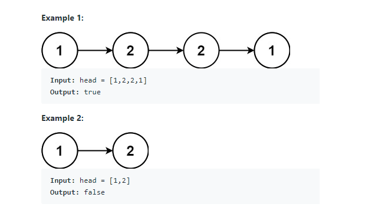
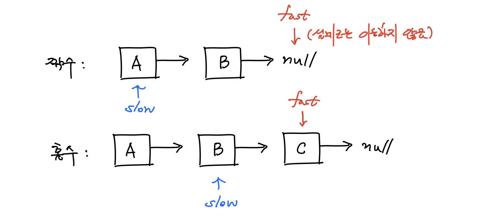
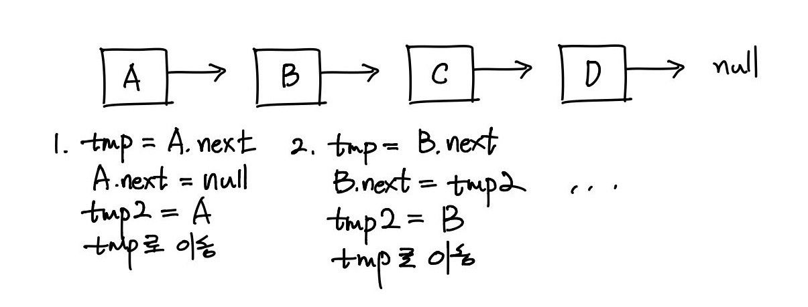

## 1. 문제 설명

주어진 일방향 링크드 리스트가 팰린드롬인지 판별하시오.



-----

## 2. 제약 조건

1. 리스트 내 노드의 개수는 1개부터 $$10^5$$개까지 존재한다.
1. 한 노드의 값은 0부터 9까지다.
2. <span style="color:grey">(선택)</span> 시간 복잡도 O(n), 공간 복잡도 O(1)으로 해결해야 한다.

-----

## 3. 접근

[9. Palindrome Number](https://leetcode.com/problems/palindrome-number/)와 비슷한 문제지만, 접근 방식이 조금 달라져야 한다. 리스트 내 노드의 개수가 열 개를 넘어가면 자연수로 쳤을 때 10억을 훌쩍 넘기기 때문이다. 하지만 문제의 본질은 같다.

관건은 입력받은 리스트의 절반을 **뒤집었을 때, 그 뒤집은 부분이 나머지 부분과 같은지** 확인하는 것이다.

- 홀수 개 노드의 경우 : 1 - 2 - 4 - 2 - 1
- 짝수 개 노드의 경우 : 1 - 5 - 5 - 1

9번 문제에서는 입력받은 정수에 모듈로 연산과 나눗셈 연산을 시행하여 간단하게 뒤집을 수 있었지만, 이 문제는 **리스트**가 주어지므로 아래와 같은 연산이 필요하다.

1. 리스트의 중간 노드를 찾아 그 위치를 반환하는 연산
2. 리스트의 절반을 뒤집는 연산

-----

### 3-1. 리스트의 중간 노드를 찾는 연산

가장 먼저 떠오른 방법은 리스트를 순회하여 노드의 총 개수를 구하는 것이었다.

그렇게 구한 노드의 개수가 홀수 개인 경우 $$\frac{n}{2} + 1$$번째 노드가 중간 노드이고, 짝수 개인 경우에도 마찬가지로 해당 노드가 뒤집어야 하는 부분의 시작점이다.

그러나 이 방법은 중간 노드를 한 번의 순회만으로 찾을 수 없다.

그렇게 해서 나온 방법이 바로 **두 개의 포인터**를 사용하는 방법이다. slow 포인터는 노드를 1개씩 방문하고, fast 포인터는 노드를 2개씩 건너뛰면서 방문한다.



이렇게 하면 slow 포인터는 언제나 fast 포인터의 중간 지점을 가리키게 된다. 뒤집을 때는 slow 포인터의 다음 노드를 시작점으로 한다.

-----

### 3-2. 리스트의 절반을 뒤집는 연산



A부터 이동하면서 위와 같은 순서로 포인터를 변경하면 리스트를 뒤집을 수 있다.

-----

## 4. 구현

```cpp
/**
 * Definition for singly-linked list.
 * struct ListNode {
 *     int val;
 *     ListNode *next;
 *     ListNode() : val(0), next(nullptr) {}
 *     ListNode(int x) : val(x), next(nullptr) {}
 *     ListNode(int x, ListNode *next) : val(x), next(next) {}
 * };
 */

class Solution {
public:
    bool isPalindrome(ListNode* head) {
        
        if(head == nullptr || head->next == nullptr)
            return true;
    
        ListNode* middle = findMiddle(head);
        ListNode* half = flipList(middle->next);
        
        return isSame(head, half);
        
    }
    
    ListNode* findMiddle(ListNode* start){
        
        ListNode* slow = start;
        ListNode* fast = start;
        
        while(fast->next != nullptr && fast->next->next != nullptr){
            slow = slow->next;
            fast = fast->next->next;
        }
        
        return slow;
        
    }
    
    ListNode* flipList(ListNode* start){
        
        ListNode* store = nullptr;
        ListNode* update = nullptr;
        
        while(start != nullptr){
            store = start->next;
            start->next = update;
            update = start;
            start = store;
        }
        
        return update;
        
    }
    
    bool isSame(ListNode* head, ListNode* half){
        
        while(half != nullptr){
            if(head->val != half->val)
                return false;
            head = head->next;
            half = half->next;
        }
        
        return true;
        
    }
    
};
```

-----

## 5. 예외 처리 및 주의사항

리스트에 노드가 없거나 노드가 하나인 경우, 무조건 참을 반환한다.
```cpp
bool isPalindrome(ListNode* head) {
    
    if(head == nullptr || head->next == nullptr)
        return true;

    // ...

}
```
또한, `half`는 리스트의 중간부터 시작하기 때문에 끝을 더 빨리 맞닥뜨리게 되므로, `half`를 기준으로 반복문의 조건을 설정한다.

```cpp
bool isSame(ListNode* head, ListNode* half){
    
    while(half != nullptr){
        // ...
    }
    
}
```
-----

## 6. 재귀를 활용한 풀이

재귀로 풀이할 수도 있다. 이 경우 콜 스택 때문에 공간 복잡도는 O(n)이 되지만, 아주 짧은 코드로 문제를 해결할 수 있다는 점에서 매력적이다. [아래 코드](https://leetcode.com/problems/palindrome-linked-list/discuss/64490/My-easy-understand-C%2B%2B-solution)는 포럼에서 가장 많은 추천을 받은 C++ 재귀 코드로, 변수명을 리팩토링하여 가져왔다.

```cpp
class Solution {
public:
    ListNode* forward;
    
    bool isPalindrome(ListNode* head) {
        forward = head;
        return check(head);
    }
    
    bool check(ListNode* backward) {
        if (backward == nullptr) return true;
        
        bool isPal = check(backward->next) && (forward->val == backward->val);
        forward = forward->next;
        
        return isPal;
    }
};
```
여기서 주목해야 할 포인터는 `forward`와 `backward`이다. 

`backward`는 리스트의 끝까지 재귀적으로 방문했다가 반환되면서 거꾸로 돌아오고, `forward`는 `backward`가 한 칸씩 뒤로 이동할 때마다 앞으로 이동하는 **전역 변수**다. 따라서 이 둘을 비교하면 주어진 리스트가 팰린드롬인지 알아낼 수 있게 된다.

이 접근이 상대적으로 비효율적인 이유는 리스트의 절반만 검사하는 게 아니라 첫번째 노드부터 마지막 노드까지 비교를 전부 진행하기 때문인데, 개선하려면 리스트의 중간 노드에서부터 재귀 호출을 시작해야 한다.

-----