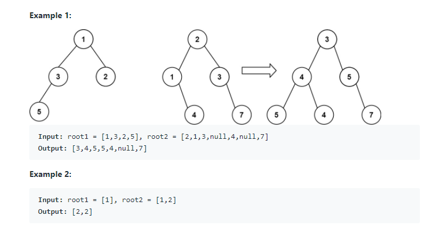

## 1. 문제 설명

두 이진 트리의 root1과 root2가 주어지면 이 둘을 병합하시오. (단, 겹치는 노드가 있으면 그 둘의 합을 새로운 노드로 한다.)



-----

## 2. 제약 조건

1. 병합은 트리의 루트에서부터 이루어져야 한다.
2. 한 트리에 있는 노드의 개수는 0개 이상 2000개 이하다.
3. 노드의 값은 $$-10^4$$ 이상 $$10^4$$ 이하다.

-----
## 3. 접근


재귀적으로 트리를 DFS 순회하되, 매 단계마다 새로운 노드를 만들었다.

```cpp
class Solution {
public:
    TreeNode* mergeTrees(TreeNode* root1, TreeNode* root2) {
        
        if(root1 == nullptr && root2 == nullptr)
            return nullptr;
        
        TreeNode* root;
        
        if(root1 != nullptr && root2 != nullptr){
            root->val = root1->val + root2->val;
            root->left = mergeTrees(root1->left, root2->left);
            root->right = mergeTrees(root1->right, root2->right);
        }
        else if(root1 != nullptr && root2 == nullptr){
            root->val = root1->val;
            root->left = mergeTrees(root1->left, nullptr);
            root->right = mergeTrees(root1->right, nullptr);
        }
        else if(root1 == nullptr && root2 != nullptr){
            root->val = root2->val;
            root->left = mergeTrees(nullptr, root2->left);
            root->right = mergeTrees(nullptr, root2->right);
        }
        
        return root;
    
    }
};
```

그러나 이 방식은 좋지 않은데, 굳이 새로 만들 필요가 없는 노드를 생성하고 있다는 점에서 낭비가 발생하기 때문이다. 두 트리의 노드가 겹치지 않으면 기존의 노드를 재활용하면 된다. 

사실, 노드가 겹쳐지더라도 굳이 새 노드를 만들 필요는 없다. 바뀌어야 하는 것은 노드의 값뿐이기 때문에, **기존 노드의 값을 갱신**하여 새로운 트리에 연결해 주었다.

```cpp
class Solution {
public:
    TreeNode* mergeTrees(TreeNode* root1, TreeNode* root2) {
        
        if(root1 == nullptr && root2 == nullptr)
            return nullptr;
        
        if(root1 == nullptr)
            return root2;
        
        if(root2 == nullptr)
            return root1;
        
        root1->val = root1->val + root2->val;
        root1->left = mergeTrees(root1->left, root2->left);
        root1->right = mergeTrees(root1->right, root2->right);
        
        return root1;
    
    }
};
```

-----

## 4. 구현

두 번째 접근에서 아래 부분은 불필요한 코드다. 두 포인터 모두 `nullptr`인 경우, 그 두 개 중에서 하나만 반환하면 되기 때문이다.

```cpp
if(root1 == nullptr && root2 == nullptr)
    return nullptr;
```

이러한 점을 고려하여 최종적으로 리팩토링한 코드는 아래와 같다.

```cpp
class Solution {
public:
    TreeNode* mergeTrees(TreeNode* root1, TreeNode* root2) {
        
        if(root1 == nullptr)
            return root2;
        
        if(root2 == nullptr)
            return root1;
        
        root1->val += root2->val;
        root1->left = mergeTrees(root1->left, root2->left);
        root1->right = mergeTrees(root1->right, root2->right);
        
        return root1;
    
    }
};
```
-----