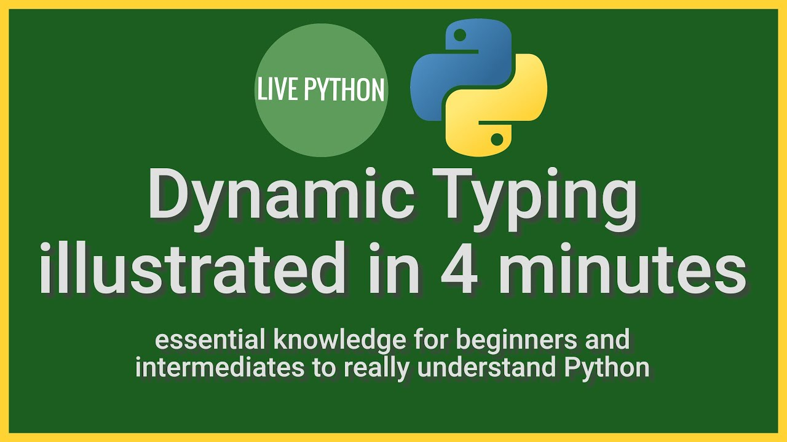

## 1. 변수의 이름

변수의 이름을 짓는 규칙은 다음과 같다.

1. **그 변수의 의미와 기능을 가장 짧게 표현할 수 있어야 한다.**
2. 알파벳, 숫자 및 언더스코어를 사용한다.
3. 숫자로 시작할 수 없다.
4. 중간에 빈칸을 넣을 수 없다.
5. 기호를 사용할 수 없다.
6. 대소문자를 구분한다.
7. 파이썬에서 이미 용도가 정해진 단어들을 사용하지 않는다.
8. 헷갈리기 쉬운 글자의 사용을 자제한다. (O,0 and 1,l)

이때 변수의 의미와 기능을 표현하기 위한 두 가지 표기법이 존재한다.

- 스네이크 케이스 : 단어들을 모두 소문자로 적고 그 사이를 언더스코어로 연결
> snake-case
- 캐멀 케이스 : 단어들의 첫 글자만 대문자로 적어서 구분
> CamelCase

파이썬의 표준 스타일 권고안 [PEP8](https://peps.python.org/pep-0008/#function-and-variable-names)에서는 **함수 및 변수에 스네이크 케이스**를, **클래스에는 캐멀 케이스**를 권장하고 있다.

파이썬에서 이미 사용 중인 키워드의 리스트를 보는 방법은 아래와 같다.

```python
import keyword
keyword.kwlist

# ['False', 'None', 'True', '__peg_parser__', 'and', 'as', 'assert', 'async', 'await', 'break', 'class', 'continue', 'def', 'del', 'elif', 'else', 'except', 'finally', 'for', 'from', 'global', 'if', 'import', 'in', 'is', 'lambda', 'nonlocal', 'not', 'or', 'pass', 'raise', 'return', 'try', 'while', 'with', 'yield']
```

## 2. 동적 자료형 결정(Dynamic Typing)

[](https://www.youtube.com/watch?v=LqVVzstFT3c)

파이썬에서는 같은 변수 이름을 여러 자료형의 객체에게 바꿔가며 할당할 수 있다. 자료형을 계속 바꿀 수 있다는 의미에서 동적 자료형 결정(Dynamic Typing)이라고 한다. 이는 C 언어 등의 다른 언어와 비교했을 때 큰 차이점이기 때문에 기억해 두어야 한다.

```python
a = 1
print(type(a)) # <class 'int'>
a = 1.0
print(type(a)) # <class 'float'>
a = "Hello, World!"
print(type(a)) # <class 'str'> 
```

## 3. 가변성과 불변성(Mutablity and Immutability)

파이썬에서는 변수가 객체를 소유하고 있는 것이 아니라 이름표에 불과하다. 따라서 아래와 같이 같은 객체에 이름표를 두 개 발급할 수도 있다. 

```python
a = 123
b = a
print(id(a), a) # 2183810996400 123
print(id(b), b) # 2183810996400 123 - same
```

그러나 이 상태에서 변수 b의 값을 바꾸면, 새로운 값을 갖는 객체를 새로 만들기 때문에 id가 달라지게 된다.

```python
b = b + 1
print(id(a), a) # 2183810996400 123
print(id(b), b) # 2183810996432 124
```

이는 정수 자료형이 <u>객체의 값을 바꿀 수 없는</u> **불변(immutable) 자료형**이기 때문이다. 파이썬에는 값을 바꿀 수 없는 불변 자료형과 가변(mutable) 자료형이 있는데, 이는 뒤에서 더 자세히 설명하기로 한다.

<center>

||불변|가변
:------:|:------:|:------:
**유형**|  int, float, bool, str, tuple  |  list, dict, set

</center>

또한 파이썬 문법에서는 변수의 값이 바뀌지 않도록 고정시키는 방법이 존재하지 않는다. 예컨대 반지름이 1.2인 원의 넓이를 구한다고 가정해 보자. 원주율 π는 바뀌지 않는 값이어야 하므로, 상수임을 표현하기 위해 **변수의 이름을 대문자**로 짓는다.
